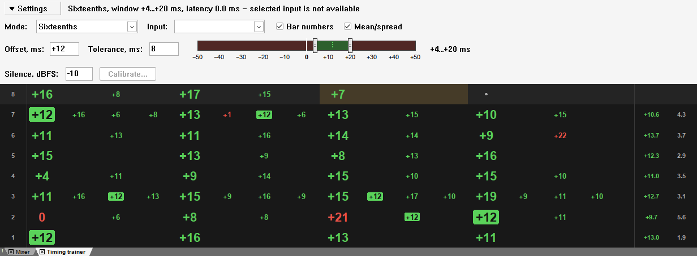
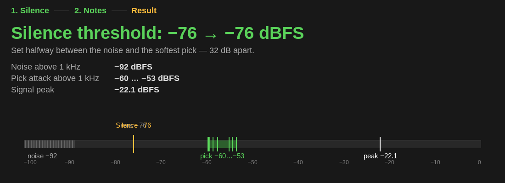

# Как пользоваться тренажёром

Тренажёр слушает гитару со входа звуковой карты и показывает, на сколько
миллисекунд каждая нота отклонилась от клика метронома REAPER.

## Подготовка

1. Подключите гитару ко входу звуковой карты напрямую, без перегруза: тренажёр
   ищет в звуке момент удара по струне, а сильный перегруз его сглаживает.
   Если гитара идёт через процессор, подайте на вход чистый сигнал (DI).
2. Включите метроном REAPER (**Options → Metronome enabled**).
3. Откройте окно: действие **reaper-training: Show/hide timing trainer** в
   списке действий (**Actions → Show action list**). Окно можно закрепить в
   доке REAPER, и после перезапуска оно откроется там же.

Ставить дорожку на запись и включать мониторинг не нужно: тренажёр берёт звук
прямо со входа.

## Окно

Сверху — настройки:

| Поле | Что задаёт |
|---|---|
| Mode | Сколько нот вы играете на один удар метронома: Quarters — 1, Eighths — 2, Eighth triplets — 3, Sixteenths — 4, Sixteenth triplets — 6 |
| Tolerance, ms | Допуск: отклонение не больше него — зелёное, больше — красное. От 1 до 50 мс, по умолчанию 10 |
| Input | Вход звуковой карты, к которому подключена гитара |
| Silence, dBFS | Порог тишины: звук тише него нотой не считается. По умолчанию −50; подходящий для вашего входа ставит калибровка, см. ниже |
| Calibrate... | Калибровка входа: тренажёр сам меряет шум и щелчок медиатора и ставит порог тишины. Во время воспроизведения недоступна; когда калибровка показывает итог, называется Finish и закрывает её |
| Bar numbers | Колонка номеров тактов слева. Выключите — такт займёт её место |
| Mean/spread | Колонка среднего и разброса по такту справа. Выключите — такт займёт её место |

Рядом — строка состояния: режим, допуск, поправка на задержку звуковой карты,
скорость воспроизведения (если она не 1.0) и что делает тренажёр — ждёт
воспроизведения, меряет или не видит выбранного входа.

Настройки общие для всех проектов и сохраняются между запусками REAPER.

**Порог тишины** сравнивается не с громкостью гитары, а с уровнем звука выше
1 кГц — по нему тренажёр ищет удар. Щелчок медиатора там примерно на 30 дБ
тише пика сигнала. Если гитара приходит тихо (DI-вход без усиления, пики около
−20 dBFS), щелчок не дотягивает до −50: тренажёр замечает ноту на 20–35 мс
позже, когда разгорится её звук, и показывает её опоздавшей. Если порог
опустить ниже уровня фона звукоснимателя, шум станет давать лишние ноты.
Порог между фоном и щелчком ставит калибровка — следующий раздел; вписать
его вручную тоже можно.

## Калибровка входа

Калибровку стоит пройти при первом запуске и после того, как поменялись
гитара, звуковая карта или усиление на входе. Транспорт должен стоять.

1. Нажмите **Calibrate...**. Вместо строк тактов появится панель калибровки,
   строка состояния покажет вход и шаг.
2. **Тишина, 3 секунды.** Положите ладонь на струны и не играйте: тренажёр
   меряет шум — фон звукоснимателя и звуковой карты выше 1 кГц. Если в это
   время прозвучит нота, панель скажет «Heard a sound — starting over», и
   3 секунды отсчитаются заново.
3. **Восемь нот.** Сыграйте восемь нот по одной, глуша каждую: так, как
   играете упражнения, две-три — тише обычного. Каждая найденная нота встаёт
   в ячейку уровнем своего щелчка медиатора; самый тихий щелчок обведён.
4. **Итог.** Через секунду после восьмой ноты панель показывает уровни: шум,
   щелчки от самого тихого до самого громкого и пик сигнала — и шкалу, где
   они отмечены вместе с порогом. Если всё в порядке, порог тишины уже стоит
   посередине между шумом и самым тихим щелчком и сохранён, а заголовок
   говорит, каким он был и каким стал.

**Close** или **Finish** на месте Calibrate... возвращает строки тактов.
Через 5 секунд после итога то же делает удар по струнам — руки можно не
убирать с гитары; запуск воспроизведения тоже закрывает итог.
**Calibrate again** начинает калибровку заново. **Cancel**, смена входа,
закрытие окна и запуск воспроизведения во время калибровки прерывают её,
порог остаётся прежним.

Если калибровка не удалась, порог не меняется, а панель говорит, почему:

| Сообщение | Что значит и что делать |
|---|---|
| Noise is too close to the pick | Между шумом и самым тихим щелчком меньше 12 дБ: любой порог либо пропустит шум как ноты, либо потеряет слабые удары. Прибавьте усиление на звуковой карте, выкрутите громкость гитары, отойдите от того, что гудит, — монитора, лампы, — и откалибруйте заново |
| The input clips | Пик дошёл до −1 dBFS: вход перегружен, удары сглажены. Убавьте усиление так, чтобы самые сильные ноты не доходили до −6 dBFS, и откалибруйте заново |
| No notes heard on … | 15 секунд без новой ноты. Проверьте, что гитара подключена ко входу, выбранному в Input, и что её громкость не на нуле |
| No sound from the audio device | Звук от звуковой карты не приходит 2 секунды. Если REAPER закрыл звуковую карту, калибровка открывает её сама, — значит, карта не открылась или не отдаёт звук. Проверьте её в **Preferences → Audio → Device** |

Кнопка **Apply ... anyway** у первых двух сообщений всё же ставит
посчитанный порог.

## Игра

Запустите воспроизведение или запись и играйте под клик. Строка окна — такт:
она появляется, как только воспроизведение входит в такт, новые — сверху, видно
последние восемь. Верхняя строка — такт, который сейчас звучит; удар, на
котором сейчас воспроизведение, подсвечен жёлтым.

Строка делится на удары такта поровну: в 4/4 — на четыре четверти, в 7/8 и 6/8
— на семь и шесть восьмых, как стучит метроном REAPER. Когда строка
появляется, каждый удар отмечен точкой. Сыгранная нота встаёт на место своего
узла сетки режима: на ударе — крупным числом, между ударами — мельче.

На снимке выше:

- **22** — номер такта.
- **0, −3, +18, −1** — отклонения нот на ударах такта 22 в миллисекундах: минус
  — раньше клика, плюс — позже. **−2, −6, +6** и другие мелкие числа — ноты
  между ударами, здесь шестнадцатые. Зелёное — в пределах допуска, красное — за
  ним.
- **Точка** — удар, на котором нота не сыграна: в такте 20 гитарист не играл,
  в такте 18 пропущен третий удар. Место между ударами без ноты остаётся
  пустым.
- **−13\*** — к этому месту пришло две ноты; показана ближайшая к клику.
- **+0.5** — среднее отклонение такта: видно, спешите вы или тянете.
- **6.2** — разброс: насколько ровно идут ноты внутри такта.

Среднее и разброс появляются, когда воспроизведение уходит из такта. Число,
которое пришло, когда уже звучит следующий такт, встаёт в строку своего такта,
и среднее с разбросом пересчитываются.

Цвет числа задаёт допуск, который действовал, когда число появилось: смена
допуска на ходу не перекрашивает уже показанное.

Если не играть несколько тактов, пауза видна одной строкой с точками —
строкой её первого такта. Пока пауза идёт, верхняя строка с точками только
меняет номер, окно не дёргается.

Смена темпа или размера отмечена синим флажком над ударом, где она стоит:
«120 → 150», «4/4 → 7/8»; смена размера и темпа на одном ударе — одна подпись,
«3/4 → 4/4 · 120 → 150». Отклонения сразу считаются по новому темпу и размеру.

Режим (Mode) задаёт сетку: к какому узлу относится нота. Сыграли триоли в
режиме Eighths — две ноты попадут в одну восьмую, и у числа будет **\***.
Смена режима действует со следующего удара.

После остановки строки остаются; новый запуск очищает список. Во время
count-in ноты не меряются: удары отсчёта не лежат на шкале проекта.

Режимы можно переключать горячими клавишами: назначьте их действиям
**reaper-training: Mode: …** в списке действий.

## Задержка звуковой карты

Нота доходит до компьютера с задержкой, и клик звучит с задержкой. Тренажёр
вычитает их по тому же правилу, по которому REAPER ставит записанный звук на
шкалу: точность тренажёра — та же, что у записи в REAPER. Если записанный
звук у вас ложится неточно, поправьте задержку в **Options → Preferences →
Audio → Recording** (Input/Output manual offset) — это исправит и запись, и
тренажёр.

Цифры появляются через доли секунды после удара. Если REAPER работает через
PulseAudio, задержка звуковой карты может достигать секунд — тогда и цифры
приходят поздно. Для тренировки выберите в **Preferences → Audio → Device**
систему ALSA (Linux) или CoreAudio (macOS).
