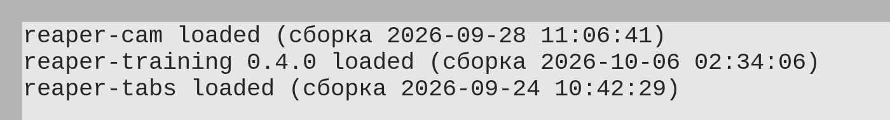

# Findings

## CI: установщики на чистых машинах (PR #4, прогон 37404662171)

Все три проверки `installer/*/ci-check.*` прошли с REAPER 7.82.

**Windows** (Inno Setup 6.7.1, windows-2025):

- REAPER 7.82 x64 при тихой установке пишет в реестр ровно то, что
  предполагал design D2: `HKLM\SOFTWARE\REAPER`, значение по умолчанию —
  `C:\Program Files\REAPER (x64)`, в 64-битном представлении. Запись об
  удалении — `HKLM\...\Uninstall\REAPER`, `DisplayName` «REAPER (x64)».
- Все запуски установщика: `Administrative install mode: No`,
  `Install mode root key: HKEY_CURRENT_USER` — даже на раннере, где у
  пользователя права администратора.
- Без REAPER — вопрос про портативный REAPER, в тихом режиме ответ «нет»,
  код выхода 1. Портативный 32-битный REAPER (`/DIR`) — «REAPER in … is
  32-bit», код 1. Папка без `reaper.ini` — отказ в `PrepareToInstall`,
  код 7.
- Деинсталлятор — `%LOCALAPPDATA%\Programs\reaper-training\unins000.exe`;
  удаление убрало модуль и из `%APPDATA%\REAPER`, и из портативной папки,
  `reaper.ini` остались.

**macOS** (macos-latest, `installer -target CurrentUserHomeDirectory`):

- `installer` из командной строки выполняет проверку установки на
  JavaScript и выводит сообщение из `Localizable.strings`: без REAPER и с
  поддельным REAPER 6 — «installer: Error - …», пакет не ставится.
- С REAPER 7.82 в `/Applications` пакет ставится от пользователя без root:
  «Installing at base path /Users/runner». Пакет перед установкой помечен
  карантином, у поставленного модуля пометки нет; владелец — пользователь.
- REAPER не в «Программах», но с `reaper.ini` в папке ресурсов — пакет
  ставится; без `reaper.ini` — отказ.
- В образе REAPER — лицензионное соглашение: `hdiutil attach` без согласия
  отменяет подключение, поэтому проверка подаёт ему `yes`.

**Linux** (контейнер ubuntu:22.04, makeself 2.4.5 из apt):

- Отказ от root и без REAPER; REAPER, поставленный `install-reaper.sh
  --install ~/opt`, найден; модуль — в `~/.config/REAPER/UserPlugins`,
  в портативный `~/opt/REAPER` с `reaper.ini`, в папку `--resource-path`;
  `--uninstall` убирает модуль, `reaper.ini` на месте.

## Вживую: Linux (задача 6.1)

Ubuntu 26.04, REAPER 7.80 в `~/opt/REAPER`, установщик
`reaper-training-0.4.0-linux-x86_64.run` из артефактов CI.

1. `sh reaper-training-0.4.0-linux-x86_64.run` — «Installed:
   ~/.config/REAPER/UserPlugins/reaper_training.so».
2. Запуск REAPER: в консоли
   `reaper-training 0.4.0 loaded (сборка 2026-10-06 02:34:06)` — сборка CI
   (`findings/linux-console.png`); в `/proc/<pid>/maps` — тот же inode, что
   у поставленного файла.
3. Повторная установка при запущенном REAPER: у файла новый inode, REAPER
   держит прежний (`(deleted)` в `maps`), работает дальше — 34 потока, на
   запрос через MCP отвечает «REAPER version: 7.80/linux-x86_64».
4. REAPER закрыт чисто, на место возвращена отладочная сборка разработчика.

Замечание: в системе остались два зависших дочерних процесса REAPER прошлой
сессии (`comm` — `reaper`, один поток, родитель — `systemd --user`).
Установщик проверяет запущенный REAPER по имени процесса и на них тоже
пишет «REAPER запущен: перезапустите его». Это только сообщение: замена
файла от него не зависит.

