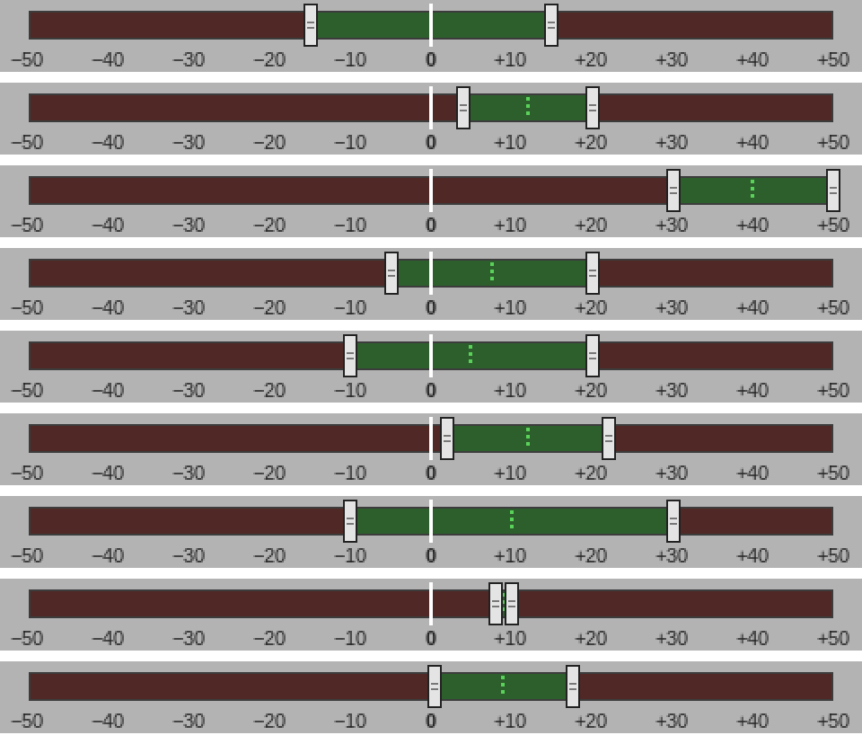
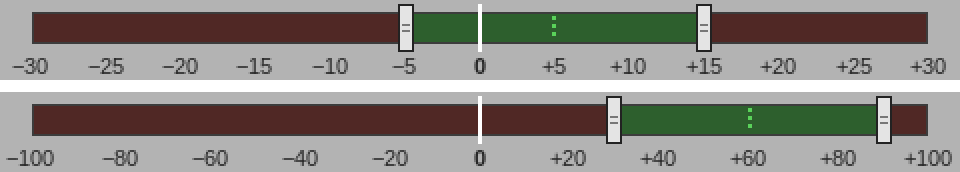
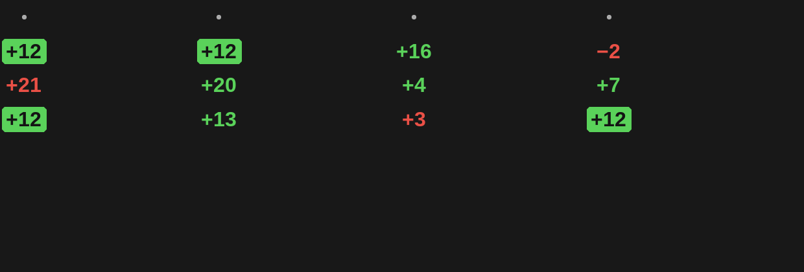
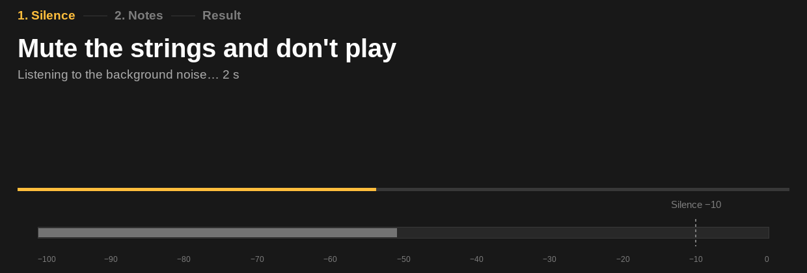
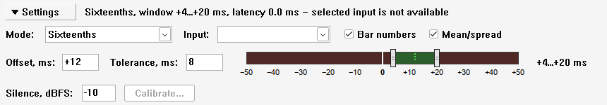

# Findings

Проверки вживую: REAPER 7.80 на Linux, ALSA, отладочная сборка
(`cmake --preset debug`). Ноты подаёт `TrainingDebug_AddNote`, мышь и
клавиатуру заменяют `TrainingDebug_DragGauge`, `TrainingDebug_TypeText` и
`TrainingDebug_ClickButton` — те же сообщения, что от мыши и с клавиатуры.
Что показывает окно, видно по журналу: строка состояния, настройки после
каждой правки, высота, с которой начинаются строки тактов. Шкалу и строки
снимают `TrainingDebug_SnapshotGauge` и `TrainingDebug_SnapshotRows` — тем же
кодом, что рисует окно.

Окно REAPER на этой машине закрыто нативным окном Wayland, и REAPER под
XWayland его не перерисовывает: снимок экрана с контролами на Linux снять не
удалось. Контролы сняты в REAPER 7.82 для Windows под Wine
(`tools/setup-windows-env.sh`) с той же отладочной сборкой; Windows в этом
изменении вживую не проверяется — Wine нужен только для снимка.

## Поля, прижатие к шкале и допуск прежней версии (задачи 2.1, 3.2)

| Что сделано | Что в журнале |
|---|---|
| `tolerance_ms=15` от прежней версии, смещения в файле нет | `window −15…+15 ms` |
| `SetHitWindow(12, 8)` | `window +4…+20 ms` |
| В Offset вписано 40 при допуске 8, затем в Tolerance — 20 | смещение +40, допуск 10, в поле после ухода — «10» |
| В Offset 7.5, в Tolerance 12.5 | `window −5…+20 ms`, в поле Offset «+7.5» |
| `window_scale_ms=30`, сохранено +40 ± 10 | после запуска `window +10…+30 ms` |
| `window_scale_ms=100`, `SetHitWindow(60, 30)` | `window +30…+90 ms` |

Окно −5…+20 и свёрнутая панель пережили перезапуск REAPER: в
`reaper-extstate.ini` — `offset_ms=7.5`, `tolerance_ms=12.5`,
`settings_collapsed=1`, записи `window_scale_ms` расширение не делает.

## Шкала (задача 3.3)

Сверху вниз: допуск 15 из прежней версии; +12 ± 8; +40 ± 10 у края шкалы;
−5…+20; правый ползунок 0 ± 10 перетащен с +10 на +20 — +5 ± 15; полоса
перетащена на 12 мс — +2…+22; щелчок на +30 — правый край на +30; левый
ползунок −10…+10 перетащен на +15 — остановился на +8; ранний край окна
+7.5 ± 10 перетащен к 0.2 — встал на +0.5, на целое число миллисекунд от
позднего +17.5.

Подписи делений реже на широкой шкале: через 5 мс при `window_scale_ms=30`,
через 20 мс при 100.

## Подложка попадания ровно в смещение (задача 3.4)

Окно +12 ± 8, четверти, ноты на 12, 13, 3, 12 мс (такт 1), 21, 20, 4, 7 мс
(такт 2), 12.4, 11.6, 16, −2 мс (такт 3). «+12» — и от 12.4, и от 11.6 мс — на
подложке; «+21», «+3», «−2» красные; остальные зелёные.

## Сворачивание панели (задача 3.1)

`TrainingDebug_ClickButton(IDC_SETTINGS_TOGGLE)` сворачивает панель — строки
тактов начинаются с 85 px вместо 416 px (экран HiDPI), — и разворачивает её.
Калибровка, начатая до сворачивания, идёт дальше, Calibrate… скрыта (нажать её
нельзя), Cancel на шаге тишины и Close на итоге кончают калибровку.

## Найдено при проверке

- **Свёрнутая панель после перезапуска открывалась развёрнутой.**
  `IsWindowVisible` в SWELL смотрит и на родителя, а окно при `WM_INITDIALOG`
  ещё не показано: контролы считались скрытыми, и их не прятали. Окно
  смотрит свой флаг контрола (`GWL_STYLE` и `WS_VISIBLE`); после исправления
  панель после перезапуска свёрнута.
- **Стрелка «▼» на кнопке под Wine — «Ђ».** Текст кнопки верный (`GetWindowTextW`
  отдаёт «▼ Settings»), но диалог рисует контролы растровым шрифтом одной
  кодовой страницы, в которой стрелок нет; в Windows у диалога без шрифта в
  ресурсе — тот же системный шрифт. Кнопку рисует окно (`BS_OWNERDRAW`):
  стрелка — треугольник, подпись — шрифтом кнопки. В тех же контролах нет и
  «−» (U+2212): диапазон рядом со шкалой и строка состояния пишут минус
  дефисом. На строках тактов и подписях шкалы, которые окно рисует шрифтом
  Arial, минус прежний.

- **Локальная сборка под Wine не пересобирает ресурс диалога** после правки
  `forms.rc`: обёртка `forms_win.rc` его включает, а зависимость не
  отслеживается. Модуль со старым ресурсом виснет, обращаясь к полю, которого
  в диалоге нет. CI собирает с нуля, его это не касается; локально помогает
  удалить `forms_win.rc.res`.
