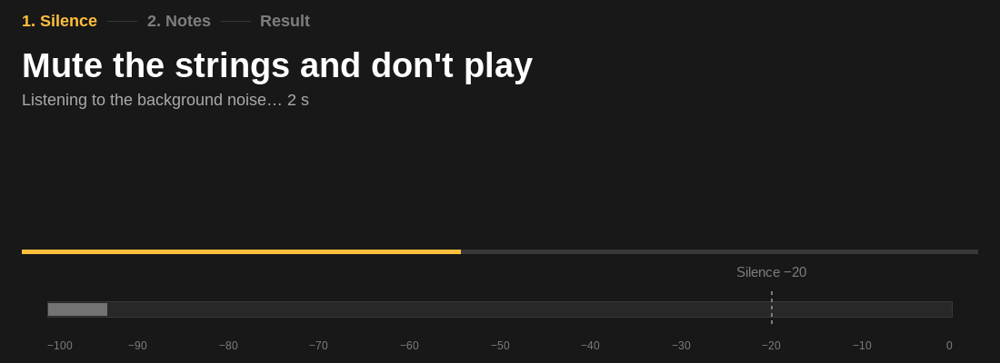
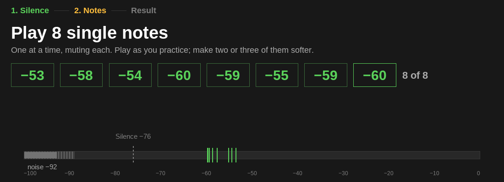
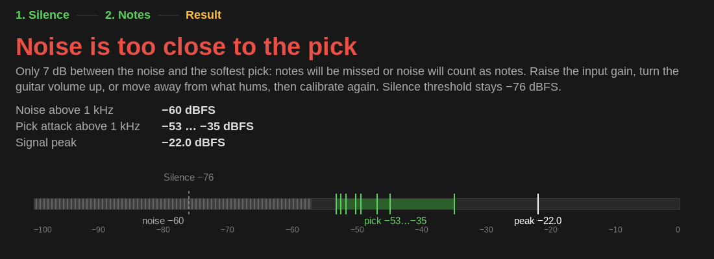
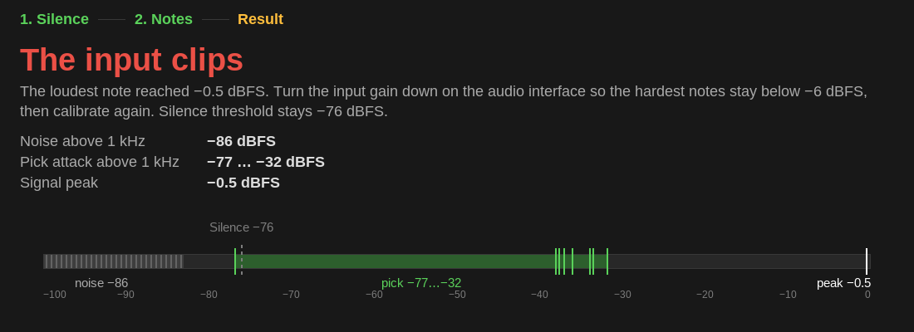
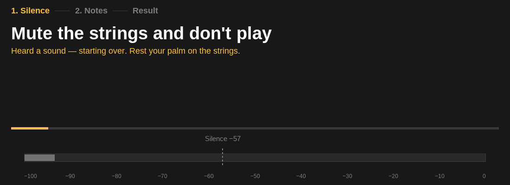
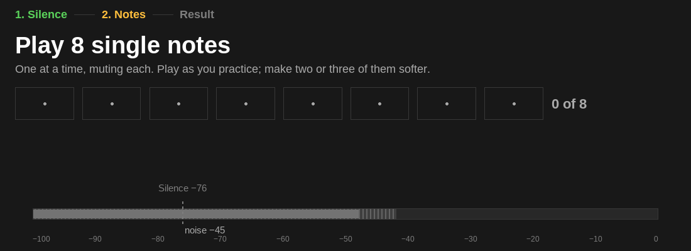
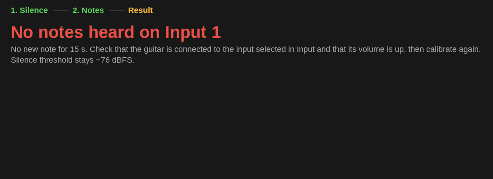
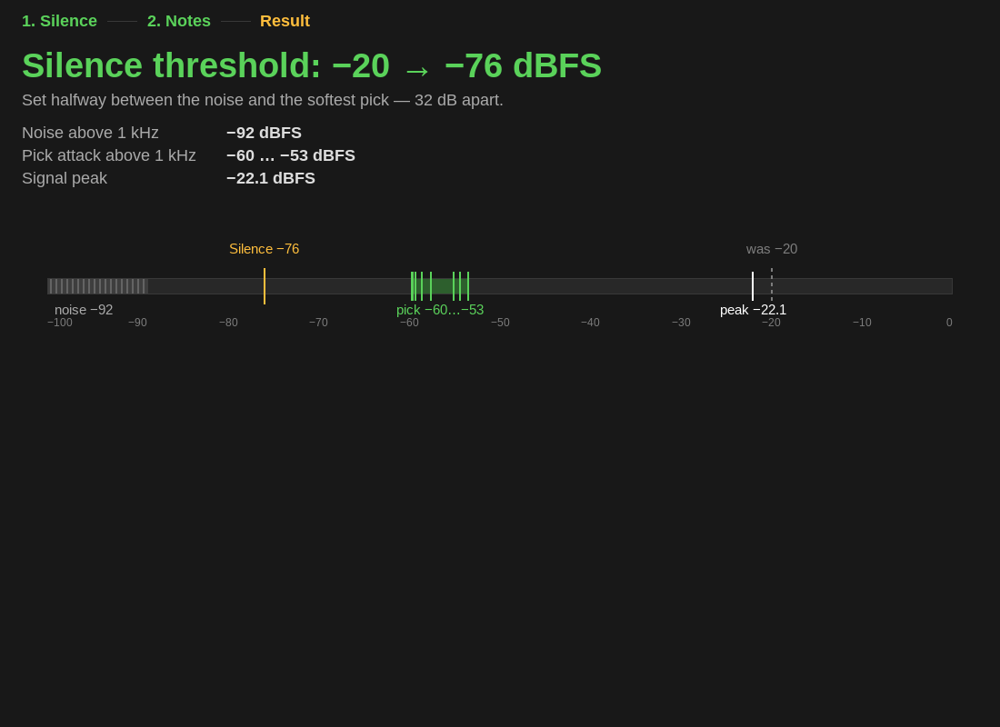

# Результаты проверок

Проверки шли на этой машине: REAPER 7.80 для Linux x86_64, ALSA, 48 кГц,
блок 512, встроенная звуковая карта со встроенным микрофоном. Гитары нет.
Отладочная сборка, сценарии — скрипты ReaScript через мост MCP.

Окно тренажёра стоит в доке главного окна REAPER, а оно закрыто другими
окнами и не перерисовывается: снимки — `TrainingDebug_SnapshotRows`, тот же
код рисования в память. Кнопок на снимках нет — это дочерние окна поверх
области. Строка состояния проверена по журналу: окно пишет её туда при каждой
смене.

## Звук для калибровки

`TrainingDebug_CalibrateFromItem` подаёт в калибровку первый канал
выделенного айтема в темпе реального времени. Айтемы — WAV, склеенные из
`tests/data/onset/di_muted_quarters.wav` и белого шума:

| Файл | Что в нём |
|---|---|
| `good.wav` | 3.5 с шума с пиком −96 dBFS, запись, 2.5 с шума |
| `close.wav` | то же, но шум с пиком −64 dBFS лежит и под записью |
| `clip.wav` | запись, усиленная в 12 раз — пик −0.5 dBFS, — между шумом −90 dBFS |
| `sound.wav` | на 1.6 с шага тишины — 0.3 с записи с первой нотой, дальше как `good.wav` |

## 5.1. Удачная калибровка

`good.wav`: шум −91.9 dBFS, восемь атак −53.5, −57.6, −54.4, −59.6, −59.3,
−55.1, −58.6, −59.7 dBFS — те же, что в тесте на этой записи, — пик
−22.1 dBFS, порог −76. Порог встал в поле Silence и в
`reaper-extstate.ini` (`silence_db=-76`). Шаг тишины кончился через 3.1 с после
начала, итог — через 1 с после восьмой ноты.

## 5.2. Отказы и прерывания

| Сценарий | Что вышло |
|---|---|
| `close.wav` | «шум близко»: шум −60.0, атаки −53.2…−34.9, зазор 7 дБ; порог не тронут. «Apply −57 anyway» ставит −57 и закрывает панель |
| `clip.wav` | «перегруз»: пик −0.5 dBFS; порог не тронут, Close закрывает панель |
| `sound.wav` | на 1.7 и 2.2 с «sound during silence», подсказка «Heard a sound — starting over»; шаг тишины кончился через 3 с после звука, итог — удача, −76 |
| Cancel на шаге тишины | сессия кончена, Close недоступна, порог прежний |
| Смена входа на 2 во время калибровки | сессия кончена, порог прежний |
| Запуск воспроизведения на шаге тишины | сессия кончена; строка состояния — «… measuring · calibration cancelled: playback started», после остановки — снова «waiting for playback»; Calibrate… во время воспроизведения не нажимается |
| «Calibrate again» на итоге | новая сессия с шага тишины |

У `clip.wav` самая тихая «атака» — −76.8 dBFS: фон усиленной записи на 18 дБ
выше шума шага тишины, и детектор с порогом «шум + 6 дБ» нашёл ноту в нём. В
настоящем входе фон в обоих шагах один; но если на шаге нот фон поднимается —
например, гитарист снял ладонь со струн, — то же случится и вживую:
калибровка возьмёт фон за самую тихую атаку, и порог встанет ниже щелчка.

## Вход при остановленном транспорте

Калибровка кнопкой Calibrate… со встроенного микрофона: первый кусок звука
пришёл через 10–40 мс после старта, транспорт стоял. Шум комнаты выше 1 кГц
−46.6 и −44.9 dBFS в двух запусках, нот нет: через 5 с без нот — подсказка
проверить вход, через 15 с — итог «No notes heard on Input 1», порог
прежний. Один раз голос в комнате на шаге тишины перезапустил отсчёт.

## Что поправлено по ходу

- **Перенос подсказки.** `DrawText` с `DT_WORDBREAK` в SWELL на Linux строку
  не переносит — подсказка уходила за край. Окно переносит по пробелам само.
- **Точки пустых ячеек** выходили разного размера: центр стоял в дробных
  пикселях. Центр теперь в целом пикселе.
- **Строка состояния** пишется в журнал при каждой смене — иначе её не
  проверить, пока окно закрыто другими окнами.
- **Правки по clang-tidy** разбили рисование панели на части. После них
  калибровка по `good.wav` и `close.wav` прогнана вживую ещё раз: те же
  уровни, порог −76, «Apply −57 anyway», панель на снимках та же.

## 6.2. Закрытие итога

| Сценарий | Что вышло |
|---|---|
| `strike.wav`: `good.wav` и ещё два удара — через 2 и 6 с после итога | итог в 30.33 с журнала, удар через 2 с панель не закрыл, удар через 6 с — закрыл в 36.57 с; порог −76 остался |
| Finish на итоге | панель закрыта, кнопка снова Calibrate... и запускает новую калибровку |
| Запуск воспроизведения на итоге | «calibration: closed by playback», строка состояния — «… measuring» без сообщения об отмене |

## 4.3. Закрытая звуковая карта

Окно и кнопки — через `TrainingDebug_ClickButton`, карта закрывается
скриптом `Audio_Quit`, ход — по журналу.

| Сценарий | Что вышло |
|---|---|
| Карта закрыта до калибровки | `GetNumAudioInputs` — 0, строка состояния — «selected input is not available», Calibrate… недоступна |
| Карта закрыта через 1 с шага тишины | на следующем тике таймера — «audio device was closed, opened: true»; шаг тишины кончился через 3.7 с после старта, калибровка перешла к шагу нот |
| Та же калибровка без закрытия карты | шум −18.0 dBFS против −19.2 с закрытием: шумит сам вход, переоткрытие карты замер не портит |
