# Findings

Проверки вживую: REAPER 7.80 на Linux, ALSA, отладочная сборка
(`cmake --preset debug`). Звук гитары в проверках окна не нужен: ноты
подаются отладочной функцией `TrainingDebug_AddNote` в заданное время шкалы.

## Такты и метки темпа (задача 1.2)

Проект: такты 1–2 — 4/4, 120; такт 3 — 150 с начала; такт 4 — 100 с
третьего удара; такт 5 — 7/8; такт 6 — 6/8; такт 7 — 3/4; такт 8 — 4/4 и 150
одной меткой; такт 9 — плавный переход 150 → 90 до начала такта 10.

Что отдаёт REAPER (`TimeMap_GetMeasureInfo` и `GetTempoTimeSigMarker`) и что
печатает отладочное действие `reaper-training (debug): print bars around the
edit cursor`:

| Такт | Начало, с (REAPER) | Размер (REAPER) | Тренажёр: первый удар, размер, начало | Тренажёр: смены |
|---|---|---|---|---|
| 1 | 0.000 | 4/4 | 0, 4/4, 0.000 | — |
| 2 | 2.000 | 4/4 | 4, 4/4, 2.000 | — |
| 3 | 4.000 | 4/4 | 8, 4/4, 4.000 | удар 1: 120 → 150 |
| 4 | 5.600 | 4/4 | 12, 4/4, 5.600 | удар 3: 150 → 100 |
| 5 | 7.600 | 7/8 | 16, 7/8, 7.600 | удар 1: 4/4 → 7/8 |
| 6 | 9.700 | 6/8 | 23, 6/8, 9.700 | удар 1: 7/8 → 6/8 |
| 7 | 11.500 | 3/4 | 29, 3/4, 11.500 | удар 1: 6/8 → 3/4 |
| 8 | 13.300 | 4/4 | 32, 4/4, 13.300 | удар 1: 3/4 → 4/4, 100 → 150 |
| 9 | 14.900 | 4/4 | 36, 4/4, 14.900 | удар 1: 150 → 90 (плавный переход) |
| 10 | 16.900 | 4/4 | 40, 4/4, 16.900 | — (конец перехода) |

- Такты, размеры и начала совпадают с REAPER; в 7/8 и 6/8 ударов 7 и 6 —
  восьмые, как у метронома (архив `add-timing-trainer`, R3).
- У метки без смены размера `GetTempoTimeSigMarker` отдаёт размер `-1/-1`,
  поэтому размер до и после метки тренажёр берёт из карты темпа по обе
  стороны от метки, а не из самой метки.
- Метка в конце плавного перехода смены не даёт: темп перед ней уже равен её
  темпу.

## Как проверялось окно

Окно REAPER на этой машине закрыто развёрнутым редактором, и REAPER под
XWayland такое окно не перерисовывает: снимок экрана отдаёт его первый кадр.
Поэтому строки снимает сам модуль отладочной сборки: `TrainingDebug_SnapshotRows`
рисует их тем же кодом, что и окно, в память и пишет в файл. Ноты подаёт
`TrainingDebug_AddNote` из отложенного скрипта Lua в момент, когда слышимая
позиция проходит ноту плюс задержку показа; порог тишины −10 dBFS, чтобы шум
входа не давал своих нот. Флажки колонок нажимает `TrainingDebug_ClickCheckbox`
— как щелчок: флажок переключается, окно получает `BN_CLICKED`. Снимок для
`docs/usage.md` — настоящий снимок окна с контролами: окно закрыто и открыто
заново во время игры, и первый кадр после открытия попадает на экранный снимок.

## Окно и настройки колонок (задачи 4.1–4.3)

120 BPM, 4/4, режим «шестнадцатые», с такта 15 те же рисунки, что в варианте
«Такт на строку» макета, задержка показа 40 мс.

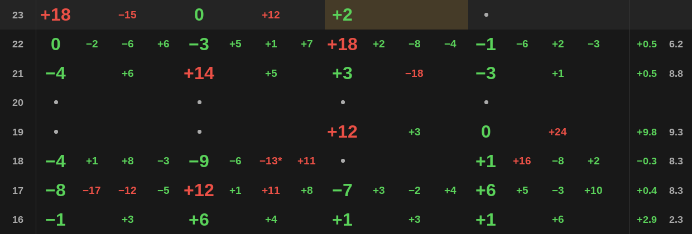

- Строка заводится при входе воспроизведения в каждый такт: в журнале
  `bar N entered` для тактов 15–25, через 5–32 мс после начала такта — на
  ближайшем тике таймера.
- Вид совпадает с макетом: номер такта, крупные значения на ударах и мелкие
  между ними, точки ударов без нот (такт 20 — пауза, третий удар такта 18),
  «−13*», среднее и разброс у всех строк, кроме верхней, тонкие линии на
  краях такта, выделенный текущий удар.
- Флажки: «Bar numbers» убирает колонку номеров и её линию, «Mean/spread» —
  колонку среднего и разброса и её линию; такт занимает их место.

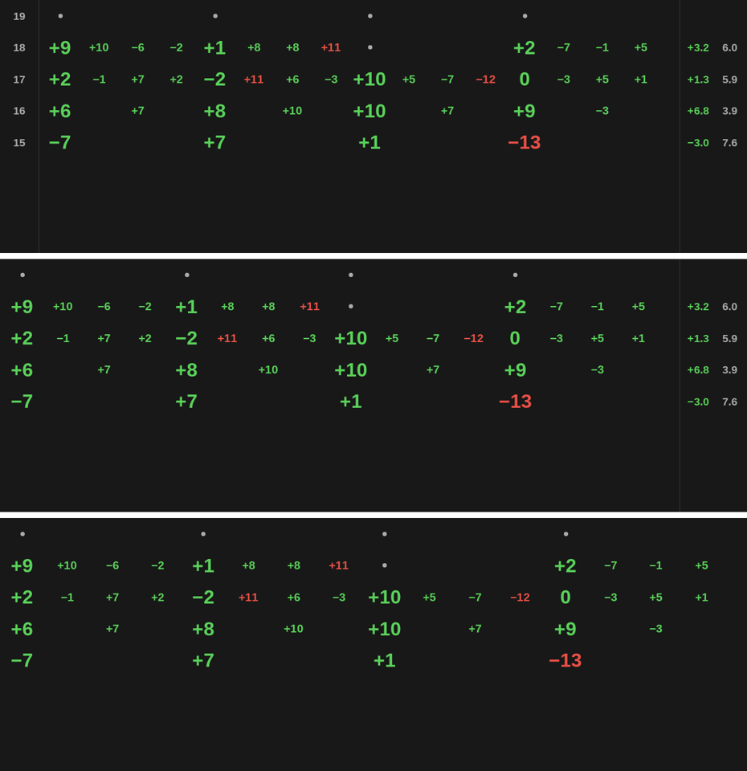

- Без ключей `show_bar_numbers` и `show_bar_stats` в `reaper-extstate.ini`
  обе колонки включены. После выключения обоих флажков и выхода из REAPER
  ключи равны 0; после запуска строки рисуются без колонок, а нажатие флажков
  возвращает 1 — они загрузились выключенными.

## Смены темпа и размера (задача 5.1)

Проект задачи 1.2. Режим «восьмые»; в каждый узел подана нота с отклонением
ровно +7 мс.

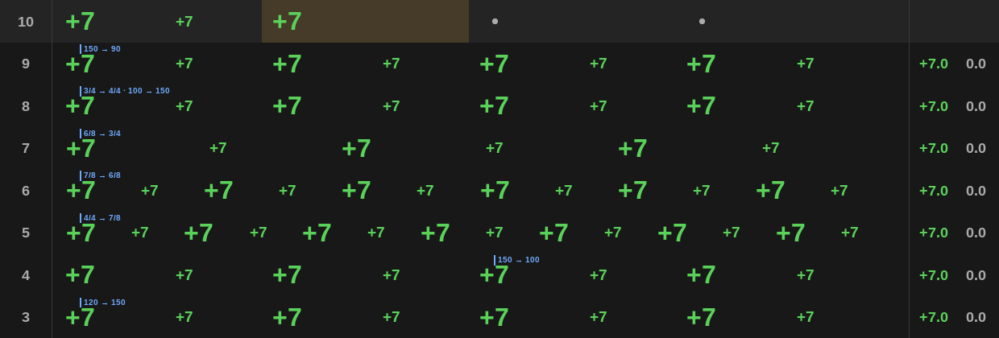

- Во всех тактах, в том числе после смены темпа посреди такта 4, в 7/8, 6/8,
  3/4 и в плавном переходе 150 → 90 такта 9, все значения «+7», среднее
  «+7.0», разброс «0.0»: узлы считаются по карте темпа на своём месте.
- Маркеры: «120 → 150» над первым ударом такта 3, «150 → 100» над третьим
  ударом такта 4, «4/4 → 7/8», «7/8 → 6/8», «6/8 → 3/4», одна подпись
  «3/4 → 4/4 · 100 → 150» в такте 8, «150 → 90» в такте 9.
- Сверку с записанным айтемом провести не удалось: во время проверки на входе
  не нашлось ни одной атаки даже при пороге −90 dBFS — звук выключен, в
  комнате тихо (пик записанного айтема −32 dBFS — один щелчок). Время нот на
  шкале это изменение не трогает; отклонение от узлов сетки тактов проверено
  поданными нотами с известным отклонением.

## Задержка показа и текущий удар (задача 5.2)

140 BPM, «шестнадцатые», показ каждой ноты через 180 мс после удара — как при
большом буфере. Ранняя нота к первому удару такта 66 — за 20 мс до клика,
показ через 5 мс, то есть до начала такта.

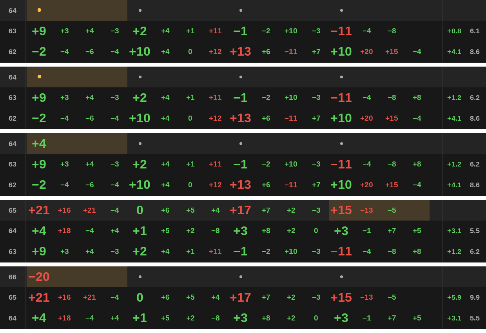

- Сразу после входа в такт 64 сверху его строка с жёлтой точкой первого
  удара; в строке 63 место последней шестнадцатой пустое.
- Её значение «+8» появилось в строке 63, когда сверху уже такт 64; среднее
  и разброс такта 63 пересчитались (+0.8 → +1.2, 6.1 → 6.2).
- Через 180 мс после удара «+4» встало на место жёлтой точки такта 64.
- Ранняя нота к такту 66 до входа в такт не видна нигде; со входом строка 66
  появилась сразу с «−20» на первом ударе.
- Выделение удара отстаёт от слышимой позиции на интервал таймера: строка
  такта заводится через 7–28 мс после его начала (журнал `bar N entered`).
- Найдена и исправлена ошибка: запуск ровно с начала такта 60 сначала завёл
  строку такта 59 — перевод позиции в удары дал «235.9999…». Позиция теперь
  считается с поправкой на погрешность счёта, есть тест.
- Буфер 2048 сэмплов в настройках звуковой карты не менялся: задержка показа
  смоделирована задержкой подачи нот, путь значения в строки тот же.

## Пауза и петля (задача 5.3)

**Пауза.** 120 BPM, «шестнадцатые»: такты 53–55 и 60–62 сыграны, 56–59 — нет.
Снимки: такт 57, сразу после входа в такт 58, такт 59, такт 60.

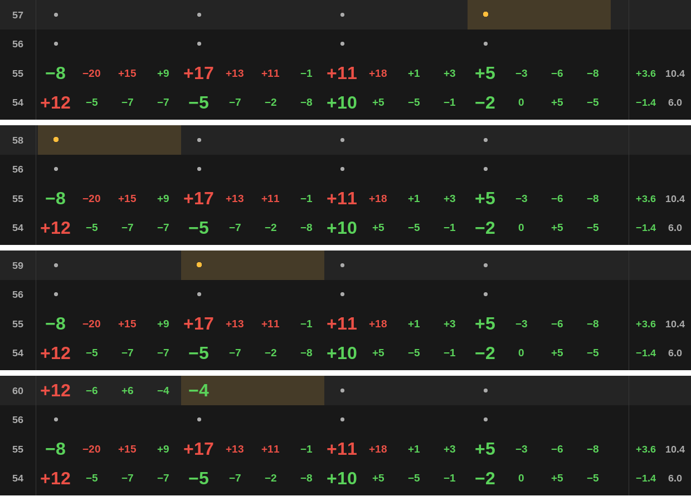

- Пока пауза идёт, сверху текущий такт с точками, под ним такт 56 — первый
  такт паузы. При входе в 58 и 59 верхняя строка меняет номер, строк столько
  же; после паузы она стала тактом 60 со значениями. Пауза видна одной
  строкой 56.
- Отдельный прогон: в паузе одна нота на последней шестнадцатой такта 57,
  показ через 150 мс — уже в такте 58. Строка 57 вернулась под верхнюю с этим
  значением.

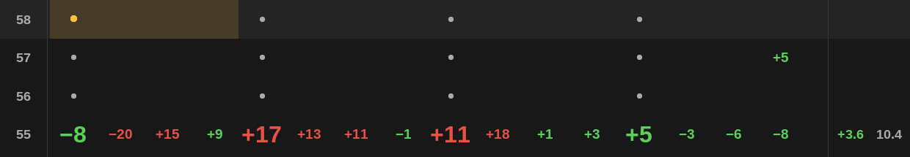

**Петли.** «Шестнадцатые», 120 BPM, четыре прохода с повтором. Последняя
шестнадцатая каждого прохода (+8 мс) показывается через 200 мс — после
заворота; первый удар следующего прохода сыгран на 15 мс раньше клика и
показан через 5 мс — до заворота. Время нот заворачивается так же, как у
тренажёра.

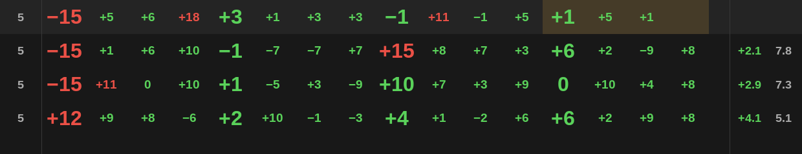

- Каждый проход даёт свою строку: в журнале `bar 5 entered` на каждом
  завороте петли в один такт, `bar 5`/`bar 6` попеременно — у петли в два.
- Поздняя «+8» каждого прохода стоит в строке своего прохода, а не в новой.
- Ранняя «−15» встала на первый удар строки нового прохода; ложных «*» на
  первом ударе нет.

## Смены настроек на ходу (задача 5.4)

120 BPM. Такт 15 — «шестнадцатые», все ноты +13 мс при допуске 10 мс. В такте
16 на втором ударе допуск 10 → 20 мс. В такте 17 посреди второго удара режим
«шестнадцатые» → «восьмые»; на третьем ударе, кроме восьмых, одна
шестнадцатая.

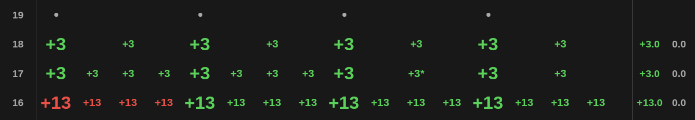

- Такт 16: значения первого удара красные — они появились при допуске 10;
  со второго удара — зелёные. Такт 15 и показанные до смены значения не
  перекрасились. Среднее такта 16 зелёное — допуск, когда воспроизведение из
  такта ушло, уже 20.
- Такт 17: второй удар доведён в «шестнадцатых» — четыре значения; с
  третьего удара узлы восьмые. Шестнадцатая на третьем ударе ушла в ближайшую
  восьмую — «+3*».
- Порог тишины −10 → −50 → −60 dBFS после остановки: строки на снимках
  до и после совпадают попиксельно; новый порог — в журнале настроек и
  действует на звук со следующего блока (`AudioInput::setSilenceDb`).

## Размеры окна (задача 5.5)

Такты 9998 (4/4, «шестнадцатые»), 9999 (7/8, «триоли шестнадцатыми» — 42
узла в строке), 10000 (4/4, «восьмые»). Строки сняты при ширине 600, 1240 и
2400 точек и с обеими выключенными колонками.

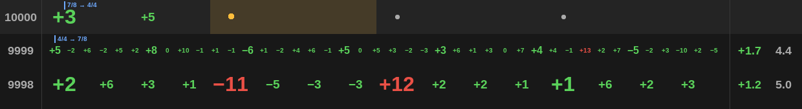

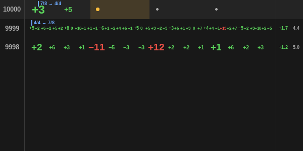

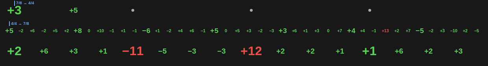

- «10000» виден целиком при любой ширине; маркеры «4/4 → 7/8» и
  «7/8 → 4/4» на месте.
- При 1240 и 2400 точках все 42 значения такта 9999 читаются и не
  наезжают; значения на ударах крупнее остальных. «Шестнадцатые» в 4/4
  помещаются и при 600 точках.
- Предел: при 600 точках 42 значения такта 9999 налезают друг на друга — на
  узел приходится около 11 точек, а «+10» даже наименьшим кеглем шире. Такая
  строка требует окна шире примерно 800 точек; выключенные колонки дают ещё
  около 110 точек.
- С выключенными колонками такт занимает всю ширину, линий по краям нет.
